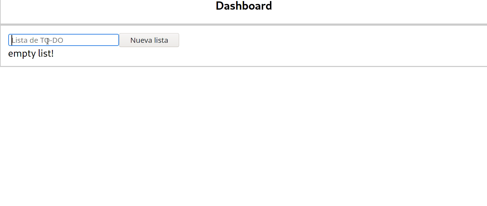

# SOLUCION #

## Back-end ##

Para el backend se implemento una libreria llamada SwaggerConfig, que nos permite generar toda la documentación completa de los endPoint del back.

En el que se puede evidenciar la estructura completa del json que se debe enviar.

En esta ruta del local se debe evidenciar la documentación 
http://localhost:9082/api/v1/swagger-ui.html#

## Front-end ##

## Docker ##

Para presentar este reto debes tener conocimientos con las siguientes tecnológicas:

 *  Spring Boot con Webflux
 *  Angular
 *  MySQL
 *  Docker

*No es necesario tener dominada las tecnologías, dentro del reto se entregará algunas guías para ayudar en el proceso, pero si es necesario conocerlas para que pueda ser facil entender la guías.*

### Caso de Uso

Se tiene presente un formulario donde se registra unas tareas basadas en una lista por hacer. Esta lista se crea para poder tener una grupos de items donde se pueda gestionar un CRUD. Se tiene un diseño muy básico pero totalmente funcional. 

### Requerimientos para desarrollo
- Maven > v3
- NodeJS > v6
- NPM > v3 
- Java > v11 

### Requerimientos para la solución
- Docker > v19
- Docker Compose > v1

#### La funcionalidad deberia quedar algo asi:

### Instalación de tu solución deberia quedar asi:

### Perspectiva Front-end
Se tiene un archivo con toda la lógica, se presentan algunas malas prácticas en la codificación del mismo. Se debe refactorizar en donde se separe los componentes en archivos y se representen una mejor estructura. 

Aplicar las mejores prácticas y buscar el mejor diseño para presentar los datos.

### Perspectiva Back-end

Dentro del back-end no se tiene una base de datos basada en servidor. Se debe aplicar un buen diseño de modelo entidad relación y aplicar una base de datos como servidor, ejemplo MySQL. Representar un objeto de trasporte de datos (DTO) en vez de usar la misma entidad para responder. 

## Evaluation criteria ##

| Criteria                                                                                               | Percentage |
| ------------------------------------------------------------------------------------------------------ | ---------- |
| Tiene una cobertura de pruebas mayor del 60% en el front end                                           | 10.0 %     |
| Tiene una cobertura de pruebas mayor del 60% en el back end                                            | 10.0 %     |
| Aplicar reactividad en el componente del backend y el frontend                                         | 20.0 %     |
| Cumple con el funcionamiento total del desafío aplicando las condiciones y los criterios de aceptación | 50.0 %     |
| Diseña la solución con buenas practicas de programación                                                | 10.0 %     |
